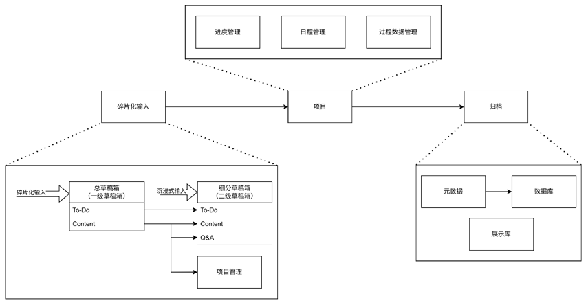
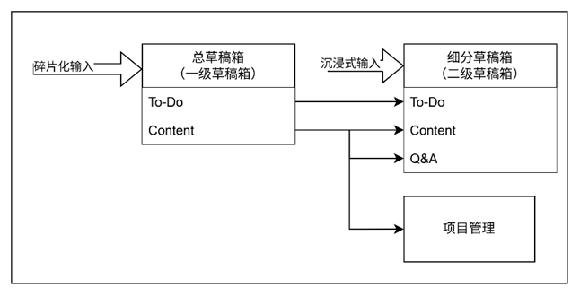
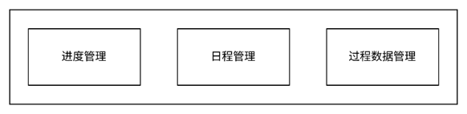
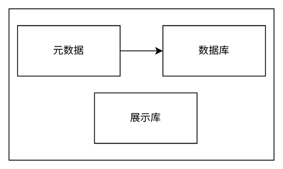

# 一套可复用的个人知识体系：从碎片输入到长期价值沉淀

## 一、我们到底在为什么而搭建「个人知识体系」？

在开始讲系统之前，先明确一个前提：

**这套体系不是为了“记更多笔记”，而是为了让你投入的时间和精力，能够在未来反复产生价值。**

如果你有过以下体验，那么你很可能需要这样一套体系：

1. 信息来源极多
    
    B 站、抖音、公众号、书籍、博客、项目文档……每天都会接触到大量“看起来很有用”的内容。
    
2. 灵感随时出现，却经常丢失
    
    在地铁上、走路时、洗漱时突然冒出一个好想法，只是随手记了一下，过几天却再也找不到。
    
3. 灵感库 / 笔记库越积越多，但无法落地
    
    明明存了很多想法，但真正要开始做时，却发现内容杂乱、不知道从哪里下手。
    
4. 学过的东西不断“重复学习”
    
    曾经花了很多时间查资料、看教程、踩坑、总结，但过一段时间再次遇到同样的问题，却不得不重新从零开始。
    
5. 学习很努力，却没有长期复利
    
    回头看发现：学过的东西要么忘了，要么对现在的自己没有任何实际帮助。
    

**这些问题的本质，并不是你不够努力，而是缺少一套“知识流转机制”。**

---

## 二、这套体系解决的核心问题是什么？

一句话总结：

> 确保你当下做的每一件事，都会对未来产生正向反馈，并且可以被反复复用。
> 

具体来说，这套体系解决了以下痛点：

- 防止零碎知识和灵感丢失
- 允许低精力状态下快速记录
- 在精力充沛时再进行整理和分类
- 用项目管理推动想法真正落地
- 在过程中自动筛除无价值信息
- 将成果沉淀为可复用的长期知识
- 避免在工具选择上反复折腾
- 使用 Markdown，保证内容可迁移、可长期保存

---

## 三、整体结构概览：知识是如何「流转」的？

如果把个人知识体系看成一个系统，那么它的核心流程非常简单：

**输入 → 整理 → 项目驱动实现 → 结构化沉淀**

对应到实际操作中，就是四个阶段：

1. **碎片化输入**
2. **二级草稿箱整理**
3. **项目管理推进**
4. **归档与复用**

你看到的这张流转图，本质上就是在描述这条路径。

---

## 四、从一个最简单的真实场景说起

假设一个非常常见的场景：

- 某天走在马路上，突然灵感乍现
- 你立刻把想法记在备忘录里
- 晚上坐在电脑前，把这个想法真正实现
- 最后把整个实现过程和结论整理保存下来

这个过程，本质上经历了三件事：

1. **输入灵感**
2. **通过项目完成实现**
3. **将经验沉淀为知识**

这正是整套体系的最小闭环。

---

## 五、模块一：碎片化输入（为什么一定要“先乱后治”）

随着时间推移，你的输入会越来越多：

- 灵感
- 待办事项
- 知识点
- 问题
- 想做但没时间做的事情

如果你试图在**输入当下就进行精细分类**，会出现两个问题：

- 极度消耗精力
- 很快感到厌倦，系统直接崩溃

### 解决方案：二级草稿箱系统

### 一级草稿箱（总草稿箱）

- **唯一目标：不丢失**
- 所有碎片化输入全部丢进来
- 不做结构设计
- 只保留最基础的区分，例如：
    - To-Do
    - Content

这是一个**低摩擦输入池**。

### 二级草稿箱（项目草稿箱）

在你有空、精力较高的时候：

- 将一级草稿箱中的内容
- 按“项目”转移到对应的二级草稿箱

每个二级草稿箱内部结构非常简单：

- To-Do：下一步要做什么
- Content：整理后的正文
- Q&A：过程中产生的问题与思考

**这一步的本质是：延迟决策，而不是不决策。**

---

## 六、模块二：项目管理（让想法真正发生）

很多知识无法沉淀，并不是因为你不会，而是因为你从未真正“做完”。

项目管理模块负责三件事：

### 1. 进度管理

- 将一个模糊想法拆分为可执行的子任务
- 明确当前进度，避免心理压力

### 2. 日程管理

- 聚焦「今天要做什么」
- 每天开始前就知道：
    - 今天完成什么，项目就算前进了一步

### 3. 过程数据管理

- 项目过程中产生的：
    - 记录
    - 中间结论
    - 尝试路径
- 统一保存，避免事后回忆式总结

项目的存在，本身就是一种**筛选机制**：

> 无法进入项目并被完成的内容，大概率对你并不重要。
> 

---

## 七、模块三：归档（让知识开始复利）

当一个项目结束后，并不意味着事情完成了。

接下来要做的是：

1. 从项目草稿箱中提炼**元数据**
2. 为每条元数据打上标签
3. 将其归档进入长期数据库

这样做的结果是：

- 下次遇到类似问题
- 你不是重新上网搜索
- 而是直接调用过去的自己

这一步，解决的是**知识复用问题**。

---

## 八、工具层的落地建议（不是唯一方案）

在 该版本的体系中，可以采用如下工具组合：

- **Notion**
    - 项目管理
    - 二级草稿箱
- **日程本**
    - 日程管理
- **Obsidian**
    - 长期知识库（Markdown）
- **本地文件夹**
    - 项目过程中产生的文件

重要的不是工具本身，而是**结构和流转逻辑**。

---

## 九、总结

这套个人知识体系，并不是让你变得更“勤奋”，而是：

- 减少无意义学习
- 减少重复劳动
- 放大时间投入的长期收益

在下一篇文章中，我会**一步一步拆解如何从零开始搭建这套体系**，包括具体页面结构与实操细节。

理论依据

1. OKR（Objectives and Key Results）
2. 项目管理（Project Management）
3. GTD（Getting Things Done）
4. 知识图谱（Knowledge Graph, KG）
5. PDCA（Plan，Do，Check，Act）
6. PBL（Problem-Based Learning）